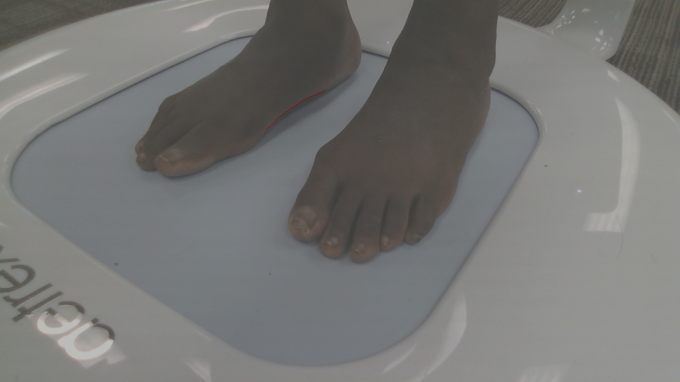
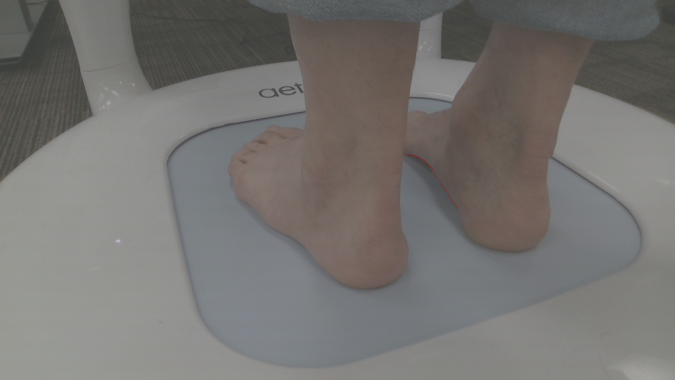
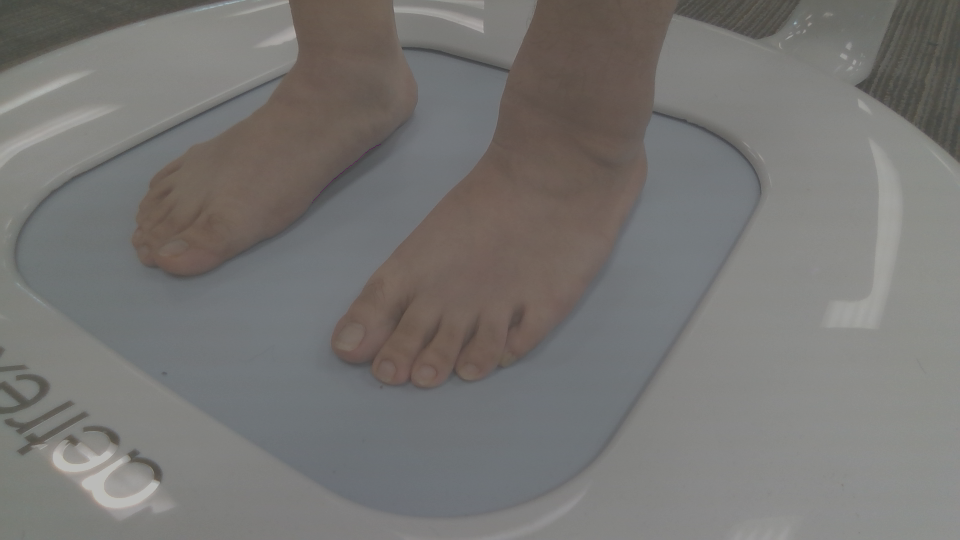
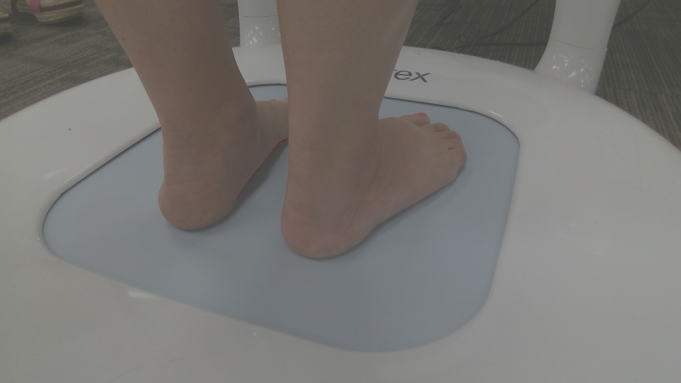
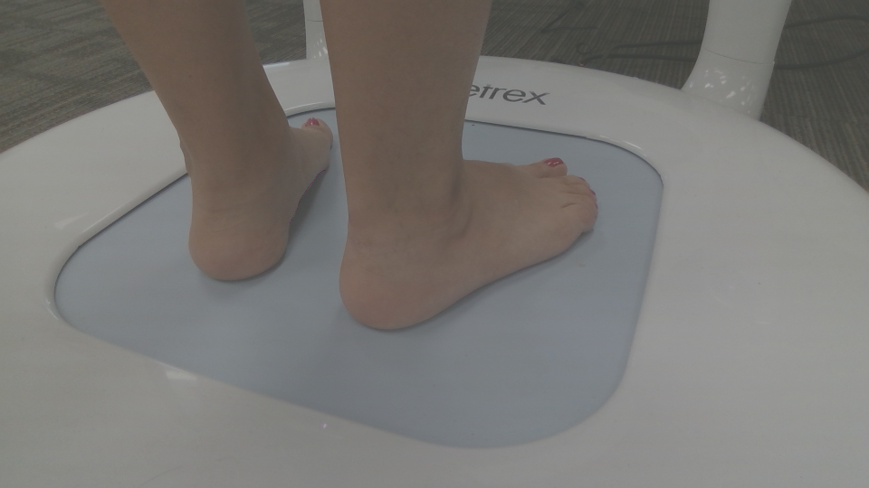

## Inference with pretrained models

The testing script 'arch_segmentation.py' is in the folder demo. We can run the following commands to obtain the arch boundary in a color image. 

```shell
python demo/arch_segmentation.py ${CONFIG_FILE} ${CHECKPOINT_FILE} --img-path ${INPUT_DIR} --show-dir ${OUTPUT_DIR} 
```

Arguments:

- `CONFIG_FILE`: Config file.
- `CHECKPOINT_FILE`: Model file.
- `--img-path`: The directory contains color images to be segmented.
- `--show-dir`: The directory contains the output images.
- `--device`: Device used for inference, default is 'cuda:0'
- `--palette`: Color palette used for segmentation map, which is defined in mmseg/core/evaluation/class_names.py.
- `--opacity`: Opacity of painted segmentation map. In (0, 1] range. default is 0.5.

Examples:

Assume that you run the script in Windows system.

```shell
python demo/arch_segmentation.py C:/Users/zliu/Projects/configs/mmseg_configs/models/point_rend_r101_512x512_160k_feetarch5k.py \
                                 C:/Users/zliu/Projects/models/mmseg/arch_pointrend/iter_2000.pth \
                                 --img-path C:/Users/zliu/Projects/foot_imgs/val_set/images \
                                 --show-dir C:/Users/zliu/Projects/foot_imgs/show \
                                 --palette feetarch \
                                 --opacity 0.4 
```

Some segmentation results are shown below:







A pickle file 'output.pkl' is generated in the folder ${OUTPUT_DIR}, which contains the list of numpy 2d array, each encoding the arch boundary.
